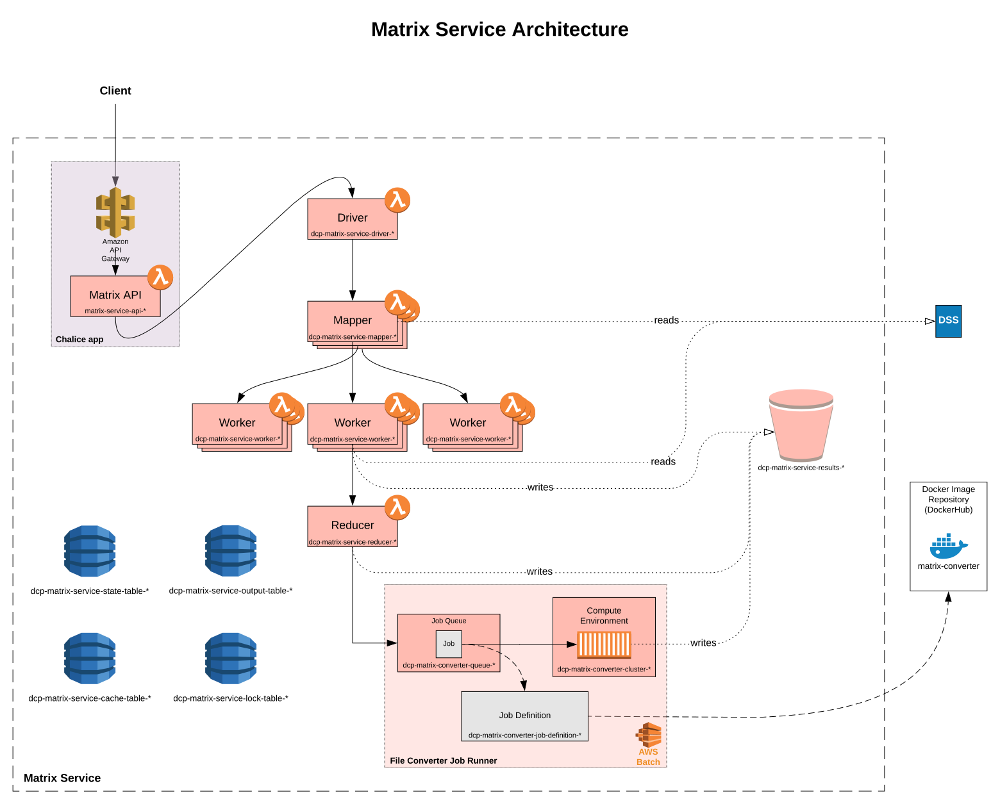

# Expression Matrix Service

[](https://matrix.data.humancellatlas.org/)
[](https://allspark.dev.data.humancellatlas.org/HumanCellAtlas/matrix-service/pipelines)
[](https://codecov.io/gh/HumanCellAtlas/matrix-service)

## Overview

The Matrix Service (MS) provides an interface to aggregrate, query and access gene expression matrices stored in the
[Human Cell Atlas](https://staging.data.humancellatlas.org/) [Data Coordination
Platform](https://www.humancellatlas.org/data-sharing) (DCP). Expression data are read from the
[DCP Data Store](https://github.com/HumanCellAtlas/data-store), processed in [AWS Lambda](https://aws.amazon.com/lambda/)
and [AWS Batch](https://aws.amazon.com/batch/) and the results are stored in [Amazon S3](https://aws.amazon.com/s3/)
buckets. The service exposes a [REST API](https://matrix.staging.data.humancellatlas.org) for querying and retrieving
expression matrix results with support for the following [file formats](#file-formats).

### Components

The logical flow of an expression matrix request is illustrated in the diagram below
[[LucidChart](https://www.lucidchart.com/invitations/accept/cdb424df-a72f-4391-9549-e83364c7234c)].
A description of each component follows.



#### Matrix API

The REST API is a [Chalice](https://github.com/aws/chalice) app that adopts [Swagger/OpenAPI](https://swagger.io/)'s
approach to specification driven development and leverages [Connexion](https://github.com/zalando/connexion) for
input parameter validation. The Chalice app is deployed with [Amazon API Gateway](https://aws.amazon.com/api-gateway/)
and [AWS Lambda](https://aws.amazon.com/lambda/). The full API documentation can be found
[here](https://matrix.staging.data.humancellatlas.org).

#### Lambdas

The preparation of an expression matrix occurs in the following five stages: the driver, mapper, worker, reducer and
the converter. The first four stages are deployed in AWS Lambda and are collectively responsible for preparing a
[zarr file structure](https://zarr.readthedocs.io/en/stable/) representing the resultant expression matrix. The
following table provides a description of each lambda:

| **Lambda** | **Description** |
|---|---|
| Driver | Initializes the matrix request in DynamoDB tables responsible for tracking the request's progress and invokes N mapper lambdas distributing the load of input bundles. |
| Mapper | For each input bundle, reads its metadata to retrieve chunking boundaries (i.e. a subset of matrix rows) used in parallel processing; invokes M worker lambdas distributing determined chunks. |
| Worker | For each chunk, apply the user-supplied query and write the matched rows to the resultant expression matrix in S3. The last worker to complete will invoke the reducer lambda. |
| Reducer | Finalizes the resultant expression matrix's zarr structure in S3. If the user-requested file format is not ``zarr``, invokes an AWS Batch job to convert the zarr to the desired file format. Otherwise, completes the request. |

#### File Converter

A file conversion job deployed on AWS Batch is used to support multiple output [file formats](#file-formats). This job
converts ``.zarr`` expression matrices to the desired file format and writes the result to S3.

#### DynamoDB

DynamoDB tables are used to track the state and progress of a request. The following is a description of the tables:

| **Table name** | **Description** |
|---|---|
| Cache table | Caches requests by a hash of its input parameters. |
| State table | Tracks the progress of a request. |
| Output table | Stores output values of the request (e.g. file format, errors). |
| Lock table | Manages locks for across distributed nodes. |


### File formats

The DCP MS enables users to prepare expression matrices in several file formats by supplying the `format` parameter when
submitting a POST request to the matrix endpoint. The following is a list of supported file formats:

- [.zarr](https://zarr.readthedocs.io/en/stable/) (default)
- [.loom](http://loompy.org/)
- [.csv](https://en.wikipedia.org/wiki/Comma-separated_values)
- [.mtx](https://math.nist.gov/MatrixMarket/formats.html)

## Getting Started

### Requirements

- Python >= 3.6
- Terraform == 0.11.10

### Developer Environment Setup

1. Clone the ``matrix-service`` repo
1. Create a virtualenv _(recommended)_ 
1. Install requirements
1. Run tests

```bash
git clone git@github.com:HumanCellAtlas/matrix-service.git && cd matrix-service
virtualenv -p python3 venv
. venv/bin/activate
pip install -r requirements-dev.txt --upgrade
make test
```

### Testing

#### Unit tests

To run unit tests, in the top-level directory, run `make test`.

#### Functional tests

Functional tests test the end-to-end functionality of a deployed environment of the service. To set the deployment
environment for which the tests will run against, set the ``DEPLOYMENT_STAGE`` environment variable to an existing
deployment name (``predev`` | ``dev`` | ``integration`` | ``staging`` | ``prod``).

To run functional tests, in the top level directory, run `make functional-test`.

### Debugging

#### Local API server

To deploy the Matrix API/Chalice app from your local machine for development purposes:

```bash
cd chalice
make build && cd ..
./scripts/matrix-service-api.py
```

#### Logs

All API logs, AWS Lambda logs and AWS Batch logs can be found in
[Amazon CloudWatch Metrics](https://console.aws.amazon.com/cloudwatch/home?region=us-east-1) under following prefixes:

| **Component** | **Log Group Prefix** | **Log Stream Prefix** |
|---|---|---|
| Matrix API | _/aws/lambda/matrix-service-api-_ | - |
| Lambdas | _/aws/lambda/dcp-matrix-service-_ | - |
| File converter | _/aws/batch/job_ | _dcp-matrix-converter-job-definition-_ |
