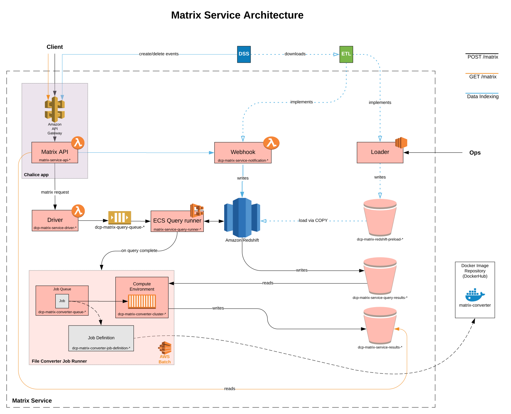

# Expression Matrix Service

[](https://matrix.data.humancellatlas.org/)
[](https://allspark.dev.data.humancellatlas.org/HumanCellAtlas/matrix-service/pipelines)
[](https://codecov.io/gh/HumanCellAtlas/matrix-service)

## Table of Contents
**[Motivation and Challenges](#motivation-and-challenges)**

**[Design Overview](#design-overview)**

**[Getting Started](#getting-started)**

## Motivation and Challenges

The Human Cell Atlas (HCA) Data Coordination Platform (DCP) ingests,
processes, and stores single-cell data, making that data easily
available to a wide audience of researchers. The single-cell data type of greatest interest to most researchers is the expression
matrix, the cell-by-gene expression values that are the starting point for many downstream analyses.

To support this most commonly requested data type, the DCP offers a specialized interface, the Expression Matrix Service, which enables investigators to easily access  and analyze HCA expression data.

### Expression Matrix Interfaces

The native interface exposed by the DCP storage system, along with the quirks of the DCP's data organization, would make working with the matrices inconvenient.
In contrast, the Expression Matrix Service enables researchers to seamlessly incorporate HCA
expression data into their existing analysis practices.

As an illustration, those familiar with dataframe manipulation will be able to work with HCA expression data as they might work with their own local data:

```python
>>> import hca.expression
>>> data = hca.expression.data
>>> data
<hca.expression.Matrix (123456989 cells, 34183 genes) int32>
>>> filtered_data = data[(data["percent_mito"] < .05) & (data["organ"] == "kidney")]
>>> filtered_data
<hca.expression.Matrix (22134 cells, 34183 genes) int32>
>>> import scanpy.api as sc
>>> adata = filtered_data.as_anndata()
>>> sc.pp.normalize_per_cell(adata, counts_per_cell_after=1e4)
...
```

Analysis package developers can integrate their existing work with HCA data:

```R
library(HumanCellAtlas)
library(SingleCellExpression)

filtered.data <- hca %>%
    filter(percent_mito < 0.05) %>%
    filter(organ == "kidney")

sce <- as(filtered.data, "SingleCellExperiment")
...
```

Portal and other interactive tool developers can have their applications make requests for HCA data with minimal overhead using web best practices.

### Challenges

A number of engineering challenges must be addressed before the interactions sketched above can be realized.

#### Scientific Utility

*Normalization and batch effect correction*

The DCP combines single-cell data from many different sources. But, batch effects in single-cell data are particularly strong. Correct analysis of combined data from the HCA requires careful handling of batch and other normalization issues.

The Expression Matrix Service could prepare a matrix from multiple
experiments that is simple and easy to use, but without adjustment for
confounding effects such a matrix may only serve to enable false discoveries.

*Metadata availability*

While much of the engineering work for expression matrices is focused on storing and delivering the expression values, practical analysis of expression data depends on metadata.

*Data formats and schemas*

Multiple single-cell analysis tools are available that depend on different representations of expression matrix data and metadata. These differences limit
interoperability with the matrix service. A small set of community dataframe
standards are required to allow seamless integration in the future.

#### Scale

The number of cells with expression data in the HCA DCP will grow by several orders of magnitude over time. The Expression Matrix Service must handle this growth in data volume.

*Query responsiveness*

The Expression Matrix Service delivers subsets of HCA expression data in response to queries from users. As the HCA and the complexity of supported queries grows, the time needed to deliver a matrix could become intolerably long. The Expression Matrix Service must implement a scalable, burstable architecture.

*Distributed computation*

Most current tertiary analyses of single-cell expression data can be reasonably performed on a single computer, but this will change soon. The Expression Matrix Service
should enable analyses distributed computation over expression data.

*Data representation and localization*

As data volume grows, when and how to localize expression data to a client will become important considerations. For example, a client should be able to refer
to subsets or operations on HCA data without unexpectedly localizing a huge amount expression data.

#### Expressing Queries

*Separation of query and matrix interfaces*

The DCP data storage system has its own evolving query interface that may or may not align well with the sorts of query expression matrix consumers want to make. The Expression Matrix Service needs to manage the interaction between the two query interfaces.

*Query execution ordering*

When a client makes a query, the most efficient action may not be to execute the query immediately but instead batch or delay operations until the client needs to realize the matrix.

*Indicating progress and expected running time*

Clients should be aware of the expected resource consumption and waiting time for a particular request.

### Existing art

Other projects have addressed similar issues:

* [PanGEO](http://pangeo-data.org)
* [Quilt](https://quiltdata.com)

## Design Overview

The Matrix Service (MS) provides an interface to aggregrate, query and access gene expression matrices stored in the
[Human Cell Atlas](https://staging.data.humancellatlas.org/) [Data Coordination
Platform](https://www.humancellatlas.org/data-sharing) (DCP). Expression data are read from the
[DCP Data Store](https://github.com/HumanCellAtlas/data-store), processed in [AWS Lambda](https://aws.amazon.com/lambda/)
and [AWS Batch](https://aws.amazon.com/batch/) and the results are stored in [Amazon S3](https://aws.amazon.com/s3/)
buckets. The service exposes a [REST API](https://matrix.staging.data.humancellatlas.org) for querying and retrieving
expression matrix results with support for the following [file formats](#file-formats).

### Components

The logical flow of an expression matrix request is illustrated in the diagram below
[[LucidChart](https://www.lucidchart.com/invitations/accept/cdb424df-a72f-4391-9549-e83364c7234c)].
A description of each component follows.



#### Matrix API

The REST API is a [Chalice](https://github.com/aws/chalice) app that adopts [Swagger/OpenAPI](https://swagger.io/)'s
approach to specification driven development and leverages [Connexion](https://github.com/zalando/connexion) for
input parameter validation. The Chalice app is deployed with [Amazon API Gateway](https://aws.amazon.com/api-gateway/)
and [AWS Lambda](https://aws.amazon.com/lambda/). The full API documentation can be found
[here](https://matrix.staging.data.humancellatlas.org).

#### Lambdas

The preparation of an expression matrix occurs in the following five stages: the driver, mapper, worker, reducer and
the converter. The first four stages are deployed in AWS Lambda and are collectively responsible for preparing a
[zarr file structure](https://zarr.readthedocs.io/en/stable/) representing the resultant expression matrix. The
following table provides a description of each lambda:

| **Lambda** | **Description** |
|---|---|
| Driver | Initializes the matrix request in DynamoDB tables responsible for tracking the request's progress and invokes N mapper lambdas distributing the load of input bundles. |
| Mapper | For each input bundle, reads its metadata to retrieve chunking boundaries (i.e. a subset of matrix rows) used in parallel processing; invokes M worker lambdas distributing determined chunks. |
| Worker | For each chunk, apply the user-supplied query and write the matched rows to the resultant expression matrix in S3. The last worker to complete will invoke the reducer lambda. |
| Reducer | Finalizes the resultant expression matrix's zarr structure in S3. If the user-requested file format is not ``zarr``, invokes an AWS Batch job to convert the zarr to the desired file format. Otherwise, completes the request. |

#### File Converter

A file conversion job deployed on AWS Batch is used to support multiple output [file formats](#file-formats). This job
converts ``.zarr`` expression matrices to the desired file format and writes the result to S3.

#### DynamoDB

DynamoDB tables are used to track the state and progress of a request. The following is a description of the tables:

| **Table name** | **Description** |
|---|---|
| Cache table | Caches requests by a hash of its input parameters. |
| State table | Tracks the progress of a request. |
| Output table | Stores output values of the request (e.g. file format, errors). |
| Lock table | Manages locks for across distributed nodes. |


### File formats

The DCP MS enables users to prepare expression matrices in several file formats by supplying the `format` parameter when
submitting a POST request to the matrix endpoint. The following is a list of supported file formats:

- [.zarr](https://zarr.readthedocs.io/en/stable/) (default)
- [.loom](http://loompy.org/)
- [.csv](https://en.wikipedia.org/wiki/Comma-separated_values)
- [.mtx](https://math.nist.gov/MatrixMarket/formats.html)

## Getting Started

### Requirements

- Python >= 3.6
- Terraform == 0.11.10

### Developer Environment Setup

1. Clone the ``matrix-service`` repo
1. Create a virtualenv _(recommended)_ 
1. Install requirements
1. Run tests

```bash
git clone git@github.com:HumanCellAtlas/matrix-service.git && cd matrix-service
virtualenv -p python3 venv
. venv/bin/activate
pip install -r requirements-dev.txt --upgrade
make test
```

### Testing

#### Unit tests

To run unit tests, in the top-level directory, run `make test`.

#### Functional tests

Functional tests test the end-to-end functionality of a deployed environment of the service. To set the deployment
environment for which the tests will run against, set the ``DEPLOYMENT_STAGE`` environment variable to an existing
deployment name (``predev`` | ``dev`` | ``integration`` | ``staging`` | ``prod``).

To run functional tests, in the top level directory, run `make functional-test`.

### Debugging

#### Local API server

To deploy the Matrix API/Chalice app from your local machine for development purposes:

```bash
cd chalice
make build && cd ..
./scripts/matrix-service-api.py
```

#### Logs

All API logs, AWS Lambda logs and AWS Batch logs can be found in
[Amazon CloudWatch Metrics](https://console.aws.amazon.com/cloudwatch/home?region=us-east-1) under following prefixes:

| **Component** | **Log Group Prefix** | **Log Stream Prefix** |
|---|---|---|
| Matrix API | _/aws/lambda/matrix-service-api-_ | - |
| Lambdas | _/aws/lambda/dcp-matrix-service-_ | - |
| File converter | _/aws/batch/job_ | _dcp-matrix-converter-job-definition-_ |
