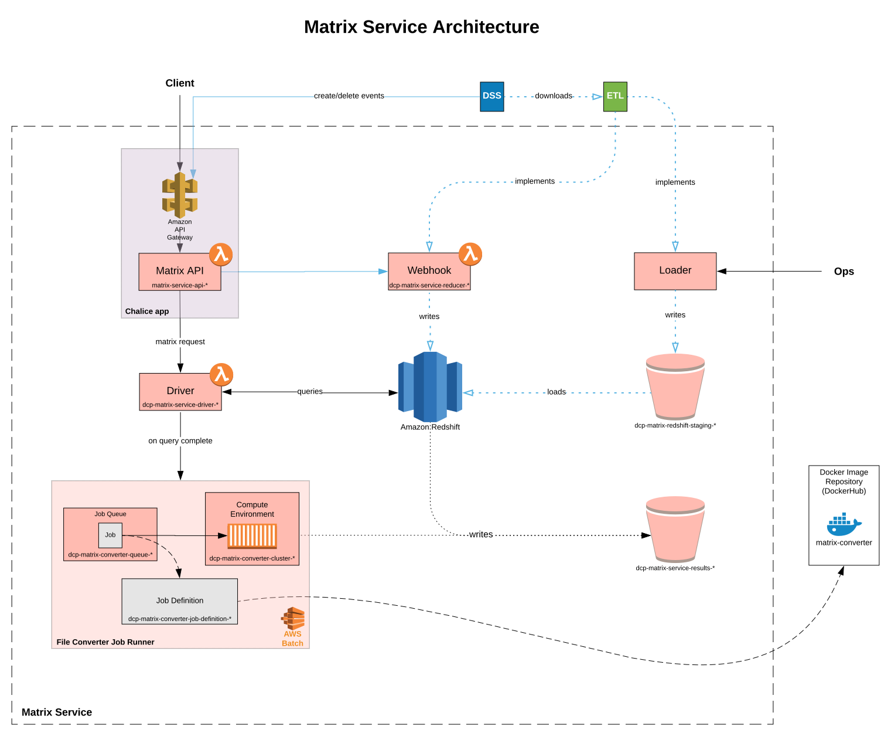

# Redshift Architecture Design

## Motivation

An experiment designed to explore the shortcomings of the Matrix Service's current design
and the advantages of alternate designs chose Redshift as a suitable alternative current
architecture. The experiment and an analysis of the factors considered are captured in this
[doc](https://github.com/HumanCellAtlas/matrix-service/blob/mckinsel-redshift/redshift/alternative_backend_design.md).

## Design

The new Redshift architecture will extend the current API to enable users to specify desired
expression data via an SQL metadata query. The API will fire a Lambda to execute the query
against Redshift to retrieve matched expression data. On query completion, the Lambda will kick
off a Batch job to generate the expression matrix in the client's specified format and upload it
to S3. The prepared expression matrices will continue to be made available to the client via a
GET endpoint on the API.

The new design will be implemented in two phases. The first phase is defined by the implementation of Redshift while 
preseving the current API (i.e. accepts only bundle UUIDs as input). The second phase will enable the API to accept
a [Redshift query](api-query-interface) that will enable numeric and metadata filtering capabilities on the Matrix
Service.



The following sections propose a design of the new architecture organized by component.

### API

#### API Query Interface

A design of the API interface for clients to describe Redshift queries is required.

#### Lambda

A single lambda will be responsible for forming and issuing the user-defined query to Redshift. Upon completion of the
query, the lambda will invoke a Batch job responsible for generating the final expression matrix.

### Redshift

#### Schema

#### Data Initailization

This section outlines the first-time initialization process for loading expression data and relevant metadata from the
DSS into Redshift. The process will be implemented as a Python script running on an EC2 instance that will be kicked off
and provisioned by a local bash script. In Python, the [dcplib ETL library]() will be implemented to download all data
required in Redshift from the DSS using an ES query similar to:
```
{
    "query": {
        "bool": {
            "should": [
                {
                    "term": {"files.analysis_process_json.tasks.task_name": "SmartSeq2ZarrConversion"},
                    "term": {"files.analysis_process_json.tasks.task_name": "10XZarrConversion"}
                }
            ]
        }
    }
}
```
The ETL library will allow the client to supply two callbacks during extraction: 1) on
download of a single bundle and 2) on completion of all requested data. The first callback will be used to
transform the bundle's contents to PSV files representing Redshift tables. The second callback will be responsible for
uploading all PSVs to an S3 bucket to be consumed by Redshift. Once uploaded, a
[COPY query](https://docs.aws.amazon.com/redshift/latest/dg/t_Loading-data-from-S3.html) will be issued to Redshift to
load the staged data in the S3 into Redshift tables.

#### DSS Updates

Data in Redshift will stay up-to-date with the DSS via DSS subscriptions. A new endpoint on the Matrix Service API will
subscribe to create and delete events in the DSS. These events will be processed in a Lambda invoked by the endpoint to
bypass API Gateway's 30s timeout. For create events, the Lambda will download the new bundle via ETL, transform relevant
data into PSV format and INSERT the new rows into their tables in Redshift. For delete events, a DELETE will be issued
to all tables and rows relating to the deleted bundle. Handling delete events will require [the schema](#schema) to
be such that all entries can be traced to a bundle UUID. To retrieve a bundle, this ES query will be supplied to the ETL
library:
```
{
    "query": {
        "bool": {
            "must": [
                {
                    "term": {"uuid": <BUNDLE-UUID>}
                }
            ]
        }
    }
}
```

_Caveat:_ This design does not maintain data integrity in the S3 staging bucket used during
[data initialization](#data-initailization). The rationale for this is the design and time complexity to handle
single bundle deletes across raw text files stored in S3. Supporting this would require scanning all files in the S3
staging bucket which is unreasonable.

### File Conversion (Batch)

The current file format conversion batch job will be updated to transform Redshift query results stored in S3 to an
expression matrix of the requested file format. This job will support the following output file formats: zarr, loom, csv
and mtx.
